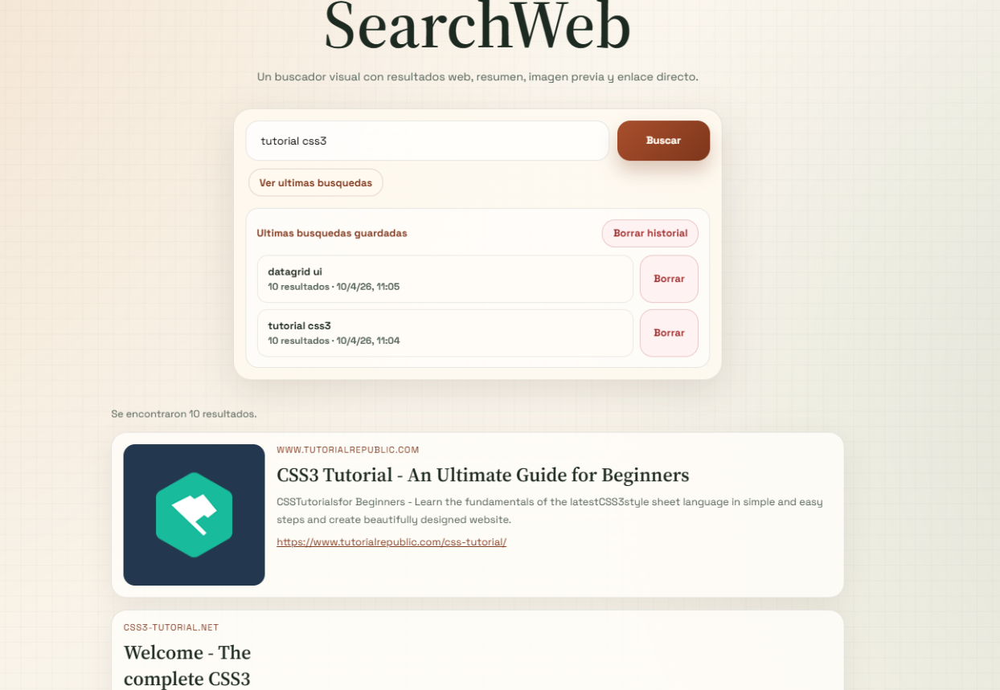

# Buscador web

## Abrir el proyecto en Chrome

### Opcion recomendada: abrirlo como aplicacion web local

1. Abre una terminal en la carpeta del proyecto.

2. Sitúate en la carpeta del proyecto:

```powershell
cd /tu ruta de carpeta /SearchWeb
```

3. Si es la primera vez que lo ejecutas en este equipo, instala las dependencias:

```powershell
Python313/python.exe -m pip install -r requirements.txt
```

4. Inicia la aplicacion:

```powershell
Python313/python.exe app.py
```

5. Cuando veas que el servidor esta levantado, abre Google Chrome.

6. Escribe esta direccion en la barra del navegador:

```text
http://127.0.0.1:5000
```

7. Pulsa Intro y se abrira el buscador.

## Si la aplicacion ya esta arrancada

Si el servidor ya esta en ejecucion, no necesitas volver a lanzar nada. Solo abre Chrome y entra en:

```text
http://127.0.0.1:5000
```

## Como abrirlo directamente desde Chrome

1. Abre Chrome.

2. Pulsa en la barra de direcciones.

3. Escribe:

```text
http://127.0.0.1:5000
```

4. Pulsa Intro.

## Si no se abre la pagina

1. Comprueba que la terminal donde lanzaste la app sigue abierta.

2. Comprueba que el comando ejecutado fue este:

```powershell
Python313/python.exe app.py
```

3. Si da error de dependencias, vuelve a ejecutar:

```powershell
Python313/python.exe -m pip install -r requirements.txt
```

4. Si el puerto 5000 estuviera ocupado, cierra la instancia anterior del programa y vuelve a arrancarlo.

## Nota
Sí, desde un terminal de VS Code se puede hacer sin problema.

Paso a paso:

1. Abre el proyecto en VS Code.
2. Abre el terminal integrado con Terminal > New Terminal.
3. Sitúate en la carpeta del proyecto:
   ```powershell
   cd SANDBOX\SearchWeb
   ```
4. Si usas el entorno virtual que ya aparece en tu sesión, actívalo:
   ```powershell
   .\.venv\Scripts\Activate.ps1
   ```
5. Si faltan dependencias, instálalas:
   ```powershell
   python -m pip install -r requirements.txt
   ```
   O, si prefieres usar el ejecutable absoluto:
   ```powershell
   Python313/python.exe -m pip install -r requirements.txt
   ```
6. Arranca la aplicación:
   ```powershell
   python app.py
   ```
   O:
   ```powershell
   Python313/python.exe app.py
   ```
7. Abre Chrome y entra en:
   ```text
   http://127.0.0.1:5000
   ```

Mientras ese terminal siga abierto, la aplicación seguirá funcionando. Si cierras el terminal, el servidor se detiene.

Si quieres, también te lo añado al README.md para que quede documentado ahí.

No abras el archivo HTML directamente con doble clic ni con una ruta file:// porque este proyecto funciona como aplicacion web con backend en Python y necesita el servidor local para responder a las busquedas.

Desde el terminal donde la arrancaste, lo normal es pulsar Ctrl + C. Eso detiene el servidor y devuelve el control al terminal.

Si la ejecutaste en el terminal integrado de VS Code:

1. Ve al terminal donde está corriendo python app.py.
2. Haz clic dentro de ese terminal.
3. Pulsa Ctrl + C.
4. Cuando PowerShell pregunte si quieres terminar, responde S o Y según te lo pida.

Si no responde a Ctrl + C, puedes cerrar ese terminal con el icono de la papelera en VS Code, pero eso ya es la opción más brusca.

Si quieres, también puedo añadir esta instrucción al README.md.
